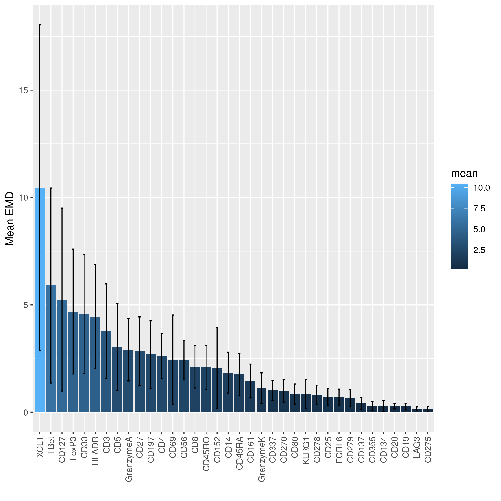
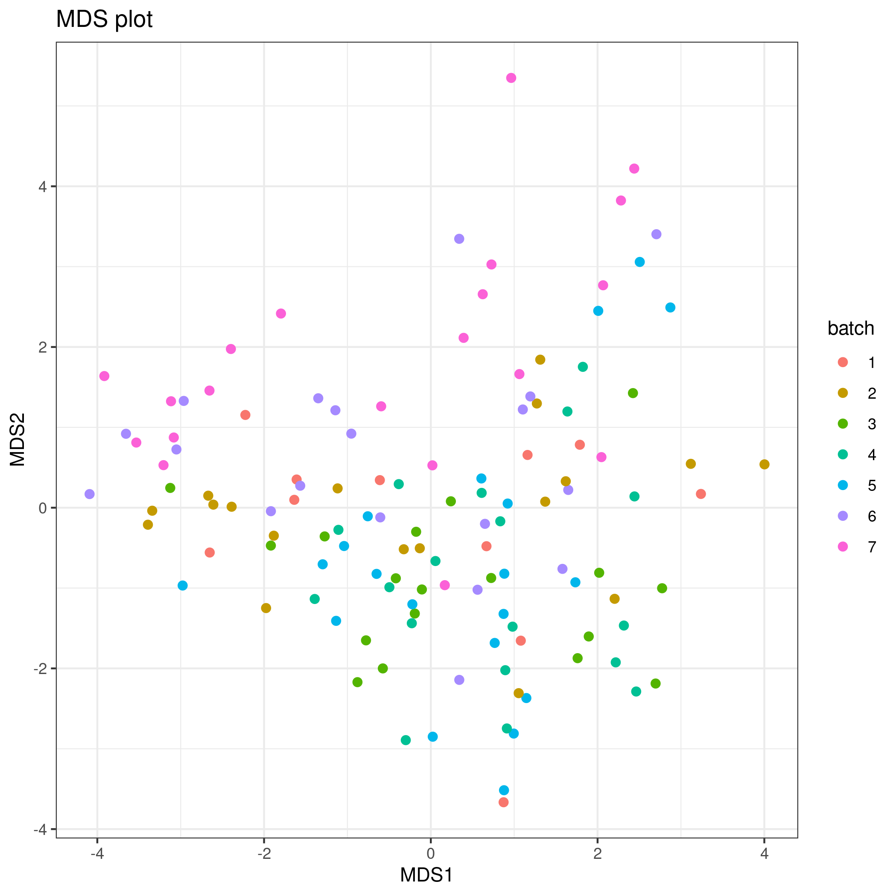

This vignette will demonstrate the batch correction of a CyTOF set consisting of 136 samples in eight batches using cyCombine.


```{r setup, include = FALSE}
knitr::opts_chunk$set(
  strip.white = T, comment = ""
)

knitr::opts_knit$set(root.dir = '/home/projects/dp_immunoth/people/s153398/cyCombine/_data/')

```


<br>
This is data from a study of CLL patients and healthy donors at the Dana-Farber Cancer Institute (DFCI). The protein expression was quantified using mass cytometry for 136 samples (20 healthy donors). The data was run in eight batches, with batch 8 being run around a half year later than the other seven batches. 


<br>

#### Pre-processing data

We start by loading some packages.

```{r libraries, results = 'hide', warning=FALSE, message=FALSE}
library(cyCombine)
library(tidyverse)
library(Seurat)

```


<br>

We are now ready to load the CyTOF data. We have set up a panel file in csv format, so the correct information is extractable from there. Let us have a look at the contents:

```{r loading flow data 1, warning=FALSE, message=FALSE}
# Directory with raw .fcs files
data_dir <- "dfci1"

# Panel and reading data
panel <- read_csv(paste0(data_dir, "/panel1.csv"))
panel

```

<br>

We then progress with reading the CyTOF dataset and converting it to a tibble format, which is easy to process. We use cofactor = 5 (default) in this case.


```{r loading data 2}
# Extracting the markers
markers <- panel %>%
  filter(Type != "none") %>%
  pull(Marker) %>%
  str_remove_all("[ _-]")

# Preparing the expression data
dfci <- prepare_data(data_dir = data_dir,
                     metadata = paste0(data_dir, "/CyTOF samples cohort.xlsx"),
                     filename_col = "FCS_name",
                     batch_ids = "Batch",
                     condition = "Set",
                     markers = markers,
                     down_sample = FALSE)

# In this dataset, the batch 8 samples are labeled as 'interim' for another purpose - we will rename this condition to 'CLL', so we can account for the biological difference between healthy and CLL samples during batch correction.
dfci$condition[dfci$condition == 'Interim'] <- 'CLL'
dfci$condition <- as.factor(as.character(dfci$condition))


```

<br>

#### Checking for batch effects
Now, let us use a cyCombine function to check if there are any batch effects to correct for at all... cyCombine will run on data even with no real batch effects, and in those cases, the batch correction should have minimal effect. However, there is no reason to run the algorithm, if we have no batch effects in the data.

```{r detect batch effects}
# We use the quicker version of the function. It generates three types of plots that may be useful in surveying a dataset for batch effects. Here, we also downsample since all cells are typically not needed to see batch effects.
detect_batch_effect_express(dfci, downsample = 10000, out_dir = paste0(data_dir, '/batch_effect_check'))

```
<br>

In the printed output, we already get some pointers to potential problems with batch effects. But let us look at each of these plots for this dataset. First we have the EMD per marker-plot, which shows the mean Earth Mover's Distance for all pairwise batch-to-batch comparisons. The distribution of each marker is considered globally for each comparison. The error bars represent the standard deviation. In this dataset, we observe a relatively high mean EMD for XCL1, and further this marker has a large standard deviation. This indicates that there may be a batch effect to consider in this marker - perhaps it is significantly over- or under-stained in one or more batches compared to the rest? According to the text, batch 1 is the problem. 



<br>

To figure out if that is really the case, we can look at the second generated plot. This is the distribution of each marker in each batch. Quantiles are shown as vertical bars. 

When looking at XCL1, we clearly observe the batch effect indicated before - batch 1 looks very different from the rest! Also, have a look at TBet. This marker had the second-highest mean EMD above - and here, the distributions for batches 6 and 7 look different than the rest.  


<br>

Now for the final plot - a multidimensional scaling (MDS) plot. This form of dimensionality reduction can be used to detect outlier batches (or samples) based on the median marker expression per *sample*. Each dot corresponds to a sample - and the colors represent batches. If there are no batch effects, the pattern would be random - and though it can be hard to judge, here we will notice how the purple batch 7 samples almost exclusively appear in the top part of the plot. Meanwhile, the pink batch 8 samples lump around (2,0).
In other words, it looks a bit like batch effects!



<br>

We could dwell more at this, and we could also use the full `detect_batch_effect()` function of cyCombine to look at this more carefully. However, for now we are convinced that batch effects exist and we will correct them with cyCombine.


<br>

#### Processing data - batch correction

<br>

Time to start the batch correction:

```{r batch correction, message=FALSE, warning=FALSE, error=FALSE, results='hide'}
# Run batch correction
corrected <- dfci %>%
  batch_correct(covar = "condition",
                xdim = 8,
                ydim = 8,
                norm_method = 'rank',
                markers = markers)

```

<br>

#### Evaluating performance

Let us look at some plots to visualize the correction. First, the marker distributions before and after:

```{r density plot, message=FALSE, fig.height=22, fig.width=12}
plot_density(dfci, corrected, ncol = 4)

```

<br>

Finally, some UMAPs to visualize the correction. We will downsample to 2,000 cells from each sample so it is easier to see what is going on.

```{r umaps, fig.height=8, fig.width=16}
inds <- split(1:length(dfci$batch), dfci$batch)
sample <- unlist(lapply(inds, sample, 2000))

plot1 <- plot_dimred(dfci[sample,], name = 'Uncorrected', type = 'umap')
plot2 <- plot_dimred(corrected[sample,], name = 'Corrected', type = 'umap')

cowplot::plot_grid(plot1, plot2)

```


<br>

Based on the marker distributions after correction and the UMAPs, it looks like the batch effects are eliminated. We can now address our biological questions.


<br>