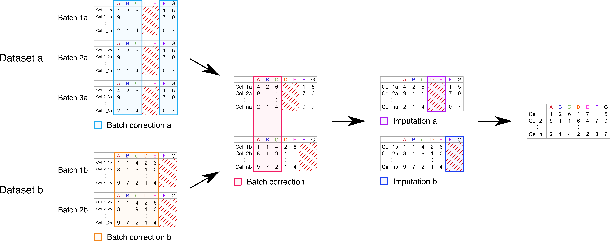

This vignette will demonstrate the batch correction of a CyTOF dataset, where samples were measured using two different panels. Not only will batch correction be performed, but we will also impute the non-overlapping markers allowing for a much more direct integration of these data.

```{r setup, include = FALSE}
knitr::opts_chunk$set(
  strip.white = T, comment = ""
)

knitr::opts_knit$set(root.dir = '/home/projects/dp_immunoth/people/s153398/cyCombine/_data/')

```

<br>

This is data from a study of CLL patients and healthy donors at the Dana-Farber Cancer Institute (DFCI). Protein expression was quantified using two different panels of proteins with an overlap. The data generated with each panel was processed in eight batches. The data is B-cell depleted.

<br>


#### Pre-processing data

In this dataset, it seems reasonable to start by looking at the two panels.

```{r libraries, results = 'hide', warning=FALSE, message=FALSE}
# Loading packages
library(cyCombine)
library(tidyverse)
library(Seurat)

```

```{r panel reading, message=F, warning=F}

# Panel 1 reading
panel1 <- read_csv("dfci1/panel1.csv")
panel1

# Panel 2 reading
panel2 <- read_csv("dfci2/panel2.csv")
panel2

```

Now, we have the panels - so let us extract the markers and identify the overlap.

```{r panel overlap}

# Extracting the markers
markers1 <- panel1 %>%
  filter(Type != "none") %>%
  pull(Marker) %>%
  str_remove_all("[ _-]")

markers2 <- panel2 %>%
  filter(Type != "none") %>%
  pull(Marker) %>%
  str_remove_all("[ _-]")

# Defining overlap
overlap_markers <- intersect(markers1, markers2)
overlap_markers

```

We observe that there is a total of 15 overlapping markers. These span a lot of the major cell types (eg. CD3, CD4, and CD8 for T cells, CD56 for NK cells and CD14 and CD33 for myeloid cell types).

<br>

The workflow presented in this vignette can be visualized with the following schematic. Dataset a and b are the the datasets for the two panels here.




<br>

We are now ready to load the CyTOF data. We convert it to a tibble format, which is easy to process. We use cofactor = 5 (default) for asinh-transformation.


```{r loading cytof data 1}
# Preparing the expression data
dfci1 <- prepare_data(data_dir = "dfci1",
                      metadata = "dfci1/CyTOF samples cohort.xlsx",
                      filename_col = "FCS_name",
                      batch_ids = "Batch",
                      condition = "Set",
                      markers = markers1,
                      down_sample = FALSE)

# In this dataset, the batch 8 samples are labeled as 'interim' for another purpose - we will rename this condition to 'CLL', so we can account for the biological difference between healthy and CLL samples during batch correction.
dfci1$condition[dfci1$condition == 'Interim'] <- 'CLL'
dfci1$condition <- as.factor(as.character(dfci1$condition))

```


```{r loading cytof data 2}
# Preparing the expression data
dfci2 <- prepare_data(data_dir = "dfci2",
                      metadata = "dfci2/CyTOF samples cohort.xlsx",
                      filename_col = "FCS_name",
                      batch_ids = "Batch",
                      condition = "Set",
                      markers = markers2,
                      down_sample = FALSE)

# In this dataset, the batch 8 samples are labeled as 'interim' for another purpose - we will rename this condition to 'CLL', so we can account for the biological difference between healthy and CLL samples during batch correction.
dfci2$condition[dfci2$condition == 'Interim'] <- 'CLL'
dfci2$condition <- as.factor(as.character(dfci2$condition))

```

<br>

#### Processing data - batch correction

In this case, the dataset for each panel is, as mentioned, run in eight batches - this means that there are likely some batch effects to correct for within each panel as well. We take of this first, before we start integrating acorss panels!


```{r batch correction within panels, message=FALSE, warning=FALSE, error=FALSE, results='hide'}
# Run batch correction
dfci1_bc <- dfci1 %>%
  batch_correct(covar = "condition",
                xdim = 8,
                ydim = 8,
                norm_method = 'rank',
                markers = markers1)

dfci2_bc <- dfci2 %>%
  batch_correct(covar = "condition",
                xdim = 8,
                ydim = 8,
                norm_method = 'rank',
                markers = markers2)

```

<br>

Let us have a quick look at some UMAPs to visualize the correction for each batch. We will downsample to 2,000 cells from each sample so it is easier to see what is going on.

```{r umaps 1, fig.height=8, fig.width=16}
# Downsampling and making pre- and post-correction UMAPs for panel 1 data
inds1 <- split(1:length(dfci1$batch), dfci1$batch)
sample1 <- unlist(lapply(inds1, sample, 2000))

plot1 <- plot_dimred(dfci1[sample1,], name = 'Uncorrected (Panel 1)', type = 'umap')
plot2 <- plot_dimred(dfci1_bc[sample1,], name = 'Corrected (Panel 1)', type = 'umap')

cowplot::plot_grid(plot1, plot2)
```


```{r umaps 2, fig.height=8, fig.width=16}
# Downsampling and making pre- and post-correction UMAPs for panel 2 data
inds2 <- split(1:length(dfci2$batch), dfci2$batch)
sample2 <- unlist(lapply(inds2, sample, 2000))

plot1 <- plot_dimred(dfci2[sample2,], name = 'Uncorrected (Panel 2)', type = 'umap')
plot2 <- plot_dimred(dfci2_bc[sample2,], name = 'Corrected (Panel 2)', type = 'umap')

cowplot::plot_grid(plot1, plot2)
```

<br>

Based on the marker distributions after correction and the UMAPs, it looks like the batch effects within the data for each panel are minimzed. Now we can focus on the integration of the two sets. The first step here, is to batch correct the datasets based on the overlapping markers.


```{r co-correction, message=FALSE, warning=FALSE, error=FALSE, results='hide'}
# Generate a combined tibble for the two datasets
df <- rbind(dfci1_bc[,c(overlap_markers, 'sample')], 
            dfci2_bc[,c(overlap_markers, 'sample')]) %>%
  mutate('batch' = c(rep(1, nrow(dfci1_bc)), rep(2, nrow(dfci2_bc))),
         'id' = 1:(nrow(dfci1_bc)+nrow(dfci2_bc)))


# Batch correct based on overlapping markers
co_corrected <- batch_correct(df,
                              markers = overlap_markers)


# Define the non-overlaping markers
missing1 <- markers2[!markers2 %in% markers1]
missing2 <- markers1[!markers1 %in% markers2]


# Add non-overlapping markers back to df
co_corrected1 <- bind_cols(co_corrected[co_corrected$batch == 1,], dfci1_bc[,missing2])
co_corrected2 <- bind_cols(co_corrected[co_corrected$batch == 2,], dfci2_bc[,missing1])

```

<br>

This was the batch correction part - now time for the non-overlapping markers. We want to impute the values for the markers unique panel 2 for the panel 1 data - and vice versa.


```{r imputation}
# Imputation for whole panels
imputed <- impute_across_panels(dataset1 = co_corrected1, 
                                dataset2 = co_corrected2,
                                overlap_channels = overlap_markers, 
                                impute_channels1 = missing1,
                                impute_channels2 = missing2)

# Extract data for each panel
final1 <- imputed$dataset1
final2 <- imputed$dataset2

```

<br>
Now, we are ready to use this combined dataset to answer the biological questions and make nice visualizations. Before finishing this vignette, let us also look at the distributions of the markers. 

First, we will view the data for each of the two panels only on the overlapping markers - *before* actually correcting these with cyCombine.


```{r density plots 1, fig.height=6, fig.width=20, message=F, warning=F}
plot_density(dfci1_bc, dfci2_bc, 
             y = 'Type',
             markers = overlap_markers, 
             dataset_names = paste('Panel', 1:2),
             ncol = 5)
```

<br>

Finally, we will look at *all* of the markers after batch corrections and imputation.


```{r density plots 2, fig.height=25, fig.width=20, message=F, warning=F}
plot_density(final1, final2, 
             y = 'Type',
             dataset_names = paste('Panel', 1:2),
             ncol = 5)


```


