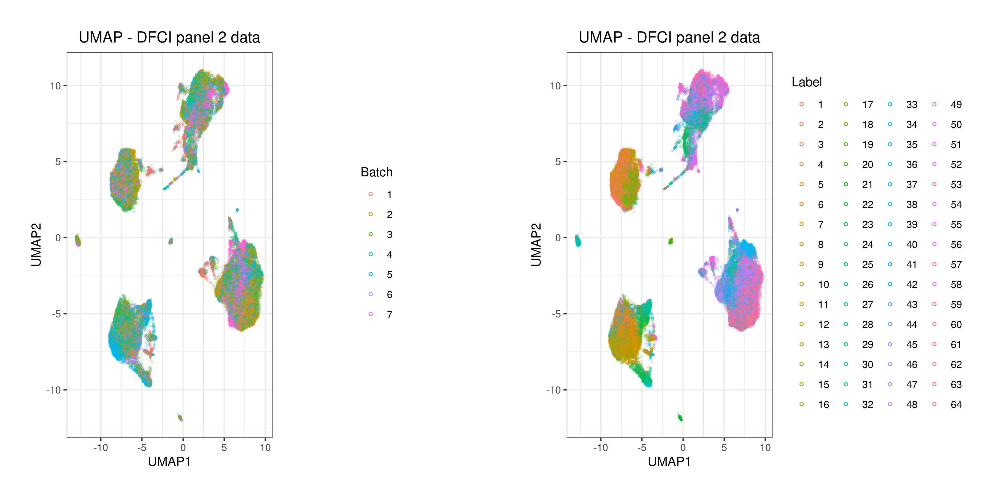
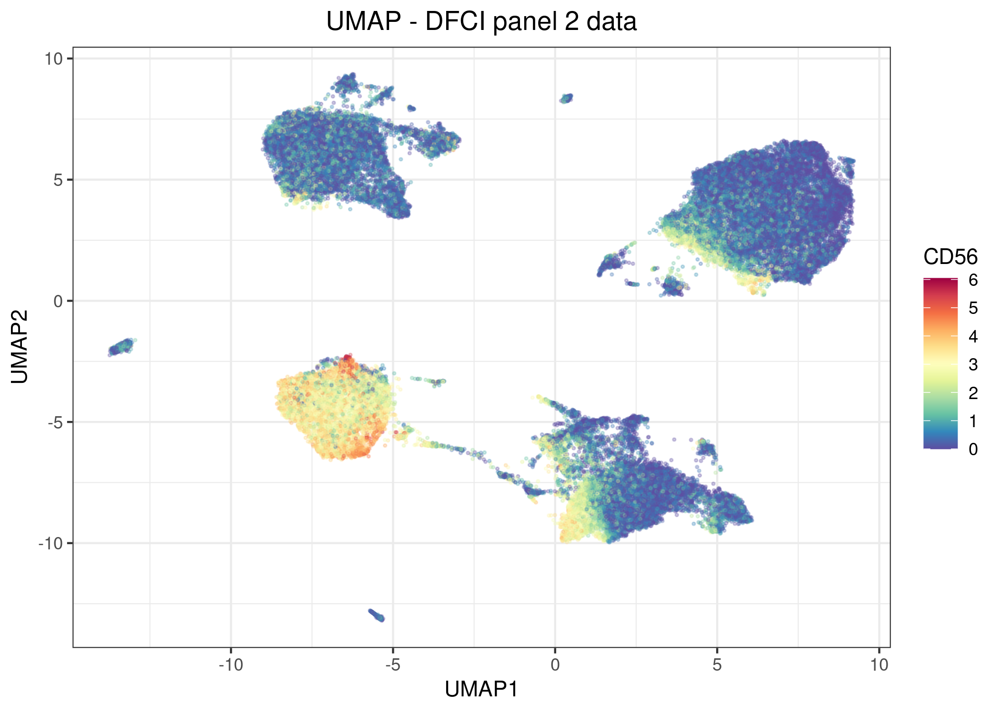
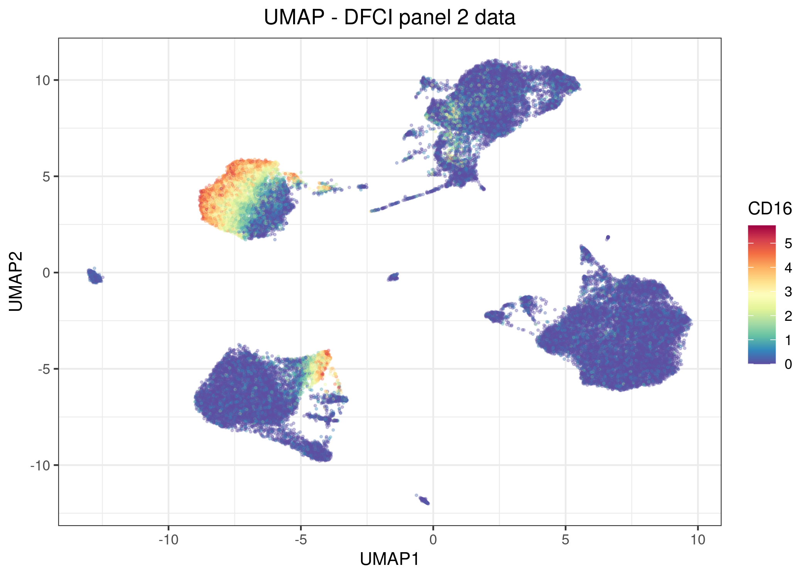

This vignette will demonstrate the use of the `detect_batch_effect` function of cyCombine.


```{r setup, include = FALSE}
knitr::opts_chunk$set(
  strip.white = T, comment = ""
)

knitr::opts_knit$set(root.dir = '/home/projects/dp_immunoth/people/s153398/cyCombine/_data/')

```

For an introduction to the `detect_batch_effect_express` function, please refer to the [one-panel CyTOF example](https://htmlpreview.github.io/?https://github.com/shdam/cyCombine/blob/master/vignettes/CyTOF_1panel.html).

<br>
The function will be demonstrated using data from a study of CLL patients and healthy donors at the Dana-Farber Cancer Institute (DFCI). The protein expression was quantified using mass cytometry for 117 samples (20 healthy donors). The data was run in eight batches, with batch 8 being run around a half year later than the other seven batches. 


<br>

#### Pre-processing data

We start by loading some packages.

```{r libraries, results = 'hide', warning=FALSE, message=FALSE}
library(cyCombine)
library(tidyverse)

```


<br>

We are now ready to load the CyTOF data. We have set up a panel file in csv format, so the correct information is extractable from there.

```{r loading data 1, warning=FALSE, message=FALSE}
# Directory with raw .fcs files
data_dir <- "dfci2"

# Panel and reading data
panel <- read_csv(paste0(data_dir, "/panel2.csv"))

```

<br>

We then progress with reading the CyTOF dataset and converting it to a tibble format, which is easy to process. We use cofactor = 5 (default) in this case.


```{r loading data 2}
# Extracting the markers
markers <- panel %>%
  filter(Type != "none") %>%
  pull(Marker) %>%
  str_remove_all("[ _-]")

# Preparing the expression data
dfci <- prepare_data(data_dir = data_dir,
                     metadata = paste0(data_dir, "/CyTOF samples cohort.xlsx"),
                     filename_col = "FCS_name",
                     batch_ids = "Batch",
                     condition = "Set",
                     markers = markers,
                     down_sample = FALSE)

```

<br>

#### Checking for batch effects
In some experiments one may already know that batch effects exist. Maybe a marker was clearly overstained in one batch or a different antibody for the same protein was used in some batches. However, sometimes it is not known if batch effects - beyond those accounted for by bead normalization - are present. Such hidden technical variation can, depending on its severity, be detrimental to a biological analysis. 

Accordingly, one should always inspect their data for batch effects before proceeding to clustering and other analysis steps. Here, we will see what can be learned from cyCombine's `detect_batch_effect` function.

```{r detect batch effects}
detect_batch_effect(dfci,
                    batch_col = 'batch',
                    out_dir = paste0(data_dir, '/batch_effect_check'), 
                    seed = 434,
                    name = 'DFCI panel 2 data')

```
<br>

In the printed output, we get some pointers to potential problems with batch effects. It points to 8 markers, which seem affected by batch effects. Furthermore, it also performs a clustering (SOM) and identifies that one of the obtained clusters has a significant under-representation in batch 8. This cluster appears to be a NK cell cluster. 


Additionally, the function provides a lot of UMAP plots, which are saved in the directory specified by `out_dir`. The first plot is the UMAP_batches_labels plot, which shows a UMAP for up to 50,000 cells across the batches in the dataset. One UMAP is colored by batch - another by SOM node (=cluster). While this might be tricky to decipher, it can be a good starting point for understanding the potential batch effects. It further generates the same UMAP colored by each protein marker in the dataset. 






It is recommended to also call the `detect_batch_effect_express` function to invesigate the output of that function and relate it to the results generated here.
<br>

