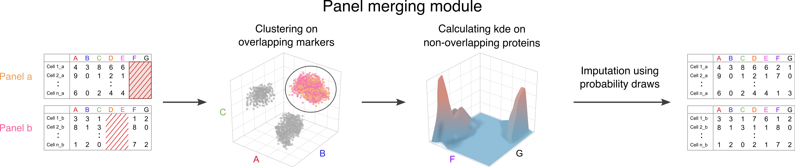

```{r setup, include = FALSE}
knitr::opts_chunk$set(
  strip.white = T, comment = "", tidy.opts=list(width.cutoff=60),tidy=T
)

knitr::opts_knit$set(root.dir = '/home/projects/dp_immunoth/people/s134891/cycombine/')
knitr::opts_chunk$set(tidy.opts=list(width.cutoff=60),tidy=TRUE)
```

This vignette will introduce the panel merging module of cyCombine which has two main functions:


#. Imputation of non-overlapping channels for whole data sets (`impute_across_panels`)
#. Imputation of single misstained (or in some other way) problematic channels (`salvage_problematic`)


These modules rely on the same main workflow, as represented by this figure:

<br>



<br>
In this vignette, we will look at these functions separately and also provide some discussion performance metrics.


## Imputation of non-overlapping channels for whole data sets
Mass cytometry and spectral flow cytometry enables quantification of ~40 proteins in parallel on millions of cells. But sometimes that is not enough to deeply characterize the populations of interest. The solution: Use two or more panels on the same cells - i.e. split you samples before staining. When this is done, however, one essentially ends up with two different datasets. Usually, these overlap partially - after all, most cytometry panels contain some of the most important cell type markers; CD3, CD4, CD8, CD14, CD19, CD56 etc. But it still is challenging to jointly analyze the data. The panel merging module of cyCombine can help researchers facing this exact challenge. Based on the overlapping markers, cyCombine is able to impute the values for the non-overlapping set, enabling co-analysis with all the markers across the applied panels.

<br>
Another example, which may be important for larger dataset integration - either across studies or platforms - is data analyzed with two different, partially overlapping panels. 

<br>

### Methodology
cyCombine's cross-dataset merging works by first performing a SOM-based (default 8x8) clustering of the datasets based on all of the overlapping markers. Then, for each cell in one of the datasets, the values for the missing markers are imputed by using the values from cells in the other dataset that fall within the same SOM node. The imputations are made by simulating a multi-dimensional kernel density estimate: Each cell’s missing values are imputed by randomly drawing a cell from the other dataset and adding a Gaussian error, which is based on a draw from a Normal distribution with mean 0 and standard deviation corresponding to the bandwidth of each marker.

However, if there are less than 50 cells from the other dataset within the SOM node, the values for the missing channels are set to NA as imputation would be unreliable.

We refer to the cyCombine vignette with a [two-panel CyTOF dataset](https://htmlpreview.github.io/?https://github.com/shdam/cyCombine/blob/master/vignettes/CyTOF_2panels.html) for a panel merging use-case.

In this vignette, we will instead focus a bit on the landscape of integration and imputation, before proceeding to an introduction to imputation  of single misstained channels.


<br>

### Discussion
In terms of advantages, the approach of cyCombine is designed to account for the underlying biology by using density draws. This is particularly important because cytometry data are not normally distributed.

In some cases, in which the variance in the marker expression is very low, and measures like the median provide a good estimate of the values to be imputed. The unfortunate thing is that those cases are often biologically uninteresting, whereas markers with bimodal expression are often the center of attention. Such markers can either be relevant for distinguishing populations and downstream differential abundance analysis, or within a cluster they may provide insight into differential expression between experimental states. 


When evaluating cyCombine, it is important to consider the following: Because of the use of density draws, it is not possible to use a one-one comparison of cells in a training set before and after imputation. This is because you might actually get some ‘wrong’ estimates with our approach - but there should be a corresponding ‘wrong’ estimate making up for that. The goal of our SOM/density-based approach is to preserve the global structure of the dataset instead of the single cell’s assignment. An additional upside to cyCombine is that it also does not exclude outlier values, as those should be sampled with the frequency that they are actually present in the data.

<br>

Naturally, this approach also has limitations: Since the method relies on the information of the overlapping markers for imputation, this overlap must be of a reasonable size and quality. This is hard to accurately define, but overall, the overlapping set should contain the most important lineage-defining markers, for imputation to work properly. Also, we would err on the side of caution when it comes to the number of markers imputed: Do not impute 100 markers based on five overlapping. How far to push this will depend on the overlap in question and also the samples. If the samples are highly similar, as in a two-panel analysis of the same samples, perhaps it is okay to impute, but if they are very different, such as from different diseases or tissues, one should be more careful.

Furthermore, we will advise against using imputed values for differential expression analysis, as this can be highly sensitive to the values. Instead, panel merging should be viewed as a tool for easing data visualization - you can get *one* UMAP for multi-panel data and the population abundances will be directly comparable sparring researchers from the trouble of having to do cluster matching (difficult) and studying separate plots since data exists in two spaces.


<br>

#### Other integration anf imputation tools
Previous work by [Abdelaal et al. (2019)](https://doi.org/10.1093/bioinformatics/btz180) suggested the CyTOFmerge approaches for 1) designing panels with an optimal overlap for imputation and 2) imputation based on k-Nearest Neighbors (kNN) and medians. However, the authors state that it is best to use their own panel design tool if panel merging is to work optimally. 

While the idea of designing multiple panels so they have an ideal information-carrying overlap is very good and should be considered best-practice, it is also not carried out in many real-life studies, in which the bioinformatician analyzing the data may only have been included after the data was generated on the CyTOF instrument. This often results in a situation where two panels with sub-optimal overlap have been run, but this is the available data.

As a result, comparing cyCombine and CyTOFmerge directly would not be fair, as they are not designed with the same purpose in mind.


<br>

We should also mention CytoBackBone by [Pereira et al. (2019)](https://doi.org/10.1093/bioinformatics/btz212), which also uses nearest-neighbor imputation. An interesting notion of acceptable neighbors is applied to avoid spurious imputations based on very distinct cells. Furthermore, they provide a very interesting test case, in which a healthy donor sample was stained with five combinations of the same set of 35 markers, which we will focus on in the next section.

<br>

Alternatively, one could look to the flow cytometry work by [Lee et al. (2011)](https://doi.org/10.1016/j.jbi.2011.03.004), which suggests a clustering-based approach for imputation. This model was however developed for two data files only and relies on the application of domain knowledge regarding marker expression of different cell types. Furthermore, it was only tested on lymphocyte data.

<br>

For combining and integrating datasets, approaches like QFMatch by [Orlova et al. (2018)](https://doi.org/10.1038/s41598-018-21444-4), SIC by [Meehan et al. (2019)](https://doi.org/10.1038/s42003-019-0467-6), and MetaCyto by [Hu et al. (2018)](https://doi.org/10.1016/j.celrep.2018.07.003) have been presented. However, these are focused on combining the results of complete analyses with cluster matching and not on allowing truly integrated analysis from start to end.


<br>

#### Mini-benchmark

Along with the CytoBackBone publication, a dataset from a healthy donor was published (FlowRepository ID: [FR-FCM-ZYV2](http://flowrepository.org/id/FR-FCM-ZYV2)). This donor was stained with five different panels, four of which were subsets of the full panel (#E). We downloaded the five pregated files from the repository and now we will read them and perform panel merging.

Panel #A and #B together have all the 35 markers included in panel #E, with an overlap of 16 markers. Similarly, panel #C and #D together have all the 35 markers included in panel #E, with an overlap of the same 16 markers. These 16 markers are, as would be a recommended choice, some of the key lineage markers:
CD1c, CD3, CD4, CD8a, CD11c, CD14, CD16, CD19, CD32, CD64, CD66, CD86, CD123, CD141, Granzyme B, and HLA-DR. In the original article, they conduct an analysis regarding the importance of each backbone marker, in which markers are ranked based on their relative importance. We will not conduct a similar analysis, but instead focus on comparing cyCombine and CytoBackBone.

```{r libraries, results = 'hide', warning=FALSE, message=FALSE}
library(cyCombine)
library(tidyverse)

```

```{r loading HEA data, results='hide', warning=F, message=F}
# Set data directory
data_dir <- 'FR-FCM-ZYV2/'

# Load five panels' data - here we assume no substantial batch effects between the five samples
panel_A <- prepare_data(data_dir = data_dir, pattern = '#A', down_sample = F, batch_ids = 'A', sample_ids = 1)
panel_B <- prepare_data(data_dir = data_dir, pattern = '#B', down_sample = F, batch_ids = 'B', sample_ids = 1)
panel_C <- prepare_data(data_dir = data_dir, pattern = '#C', down_sample = F, batch_ids = 'C', sample_ids = 1)
panel_D <- prepare_data(data_dir = data_dir, pattern = '#D', down_sample = F, batch_ids = 'D', sample_ids = 1)
panel_E <- prepare_data(data_dir = data_dir, pattern = '#E', down_sample = F, batch_ids = 'E', sample_ids = 1)
```

We will do panel merging with two panels at a time. 
Let us first focus on panels A and B.

```{r panel A+B, results='hide', message=F, warning=F}
# Define the overlap (16 markers)
overlap_AB <- intersect(get_markers(panel_A), get_markers(panel_B))

# Define markers unique to each panel
missing_A <- get_markers(panel_B)[!(get_markers(panel_B) %in% overlap_AB)]
missing_B <- get_markers(panel_A)[!(get_markers(panel_A) %in% overlap_AB)]

# Perform imputations
panel_AB <- impute_across_panels(dataset1 = panel_A,
                                 dataset2 = panel_B,
                                 overlap_channels = overlap_AB,
                                 impute_channels1 = missing_A,
                                 impute_channels2 = missing_B)


# Combine the dataframes for each set
panel_AB <- rbind(panel_AB$dataset1, panel_AB$dataset2)

```

And then let us integrate panels C and D.

```{r panel C+D, results='hide', message=F, warning=F}
# Define the overlap (16 markers)
overlap_CD <- intersect(get_markers(panel_C), get_markers(panel_D))

# Define markers unique to each panel
missing_C <- get_markers(panel_D)[!(get_markers(panel_D) %in% overlap_CD)]
missing_D <- get_markers(panel_C)[!(get_markers(panel_C) %in% overlap_CD)]

# Perform imputations
panel_CD <- impute_across_panels(dataset1 = panel_C,
                                 dataset2 = panel_D,
                                 overlap_channels = overlap_CD,
                                 impute_channels1 = missing_C,
                                 impute_channels2 = missing_D)


# Combine the dataframes for each set
panel_CD <- rbind(panel_CD$dataset1, panel_CD$dataset2)

```


Now that both sets of panel pairs have been integated, we can compare the Earth Mover's Distance to panel E which contained the full set of markers. First, we will look at the densities of each marker - both for the overlapping channels and the imputed ones.


```{r panel A+B evaluation, results='hide', message=F, warning=F, fig.height=18, fig.width=14}
# And let's look at the marker density of A+B and C+D relative to the full panel (E)
plot_density(uncorrected = panel_E,
             corrected = rbind(panel_AB[,colnames(panel_E)], panel_CD[,colnames(panel_E)]), 
             dataset_names = c('Panel E', 'Panel A+B and C+D'),
             ncol = 5)

```


Overall, this looks quite good. Even looking at a marker like CD3, which was a part of all five panels, the distributions are not completely identical, so it would be a hard requirement to impose on imputations. Now, we will use the Earth Mover's Distance (EMD) to look at the imputations more quantitatively. 


```{r cycombine evaluation, results='hide', message=F, warning=F, fig.width=16, fig.height=5}
# Combine all datasets
combined <- rbind(panel_AB[,colnames(panel_E)], panel_CD[,colnames(panel_E)], panel_E)

# EMD calculations for all batches - here we perform these globally, since the datasets are from the same healthy donor sample
emd_all <- compute_emd(df = combined, 
                       cell_col = 'sample')[[1]]

boxplot(emd_all, main = 'EMD for all markers (cyCombine)', ylab = 'EMD', col = c('#F8766D', '#619CFF')[as.numeric(names(emd_all) %in% overlap_AB)+1])
legend("topright", legend = c('Overlap', 'Imputed'), col = c('#619CFF', '#F8766D'), pch = 15, cex = 2, bty = 'n')
```


Now, we better compare ourselves to the performance of CytoBackBone...


<br><br>

## Imputation of single misstained channels
Imagine that you have run an expensive and time-consuming cytometry experiment. You have 100+ samples and despite the ability to use barcoding for sample multiplexing you have run several batches. However, now that you visualize the data, you notice that the expression level for a marker in one of the batches looks very different than in the others. It may be strongly over-stained - or maybe there is no signal at all - maybe the antibody was damaged during the sample preparation. 


In any case, you really wish that you could correct this marker in this single batch. This is because you need the marker for clustering - and if it's non-sensical in one batch it could ruin the whole analysis plan. Enter cyCombine! In particular the `salvage_problematic` function, which allows imputation of a single marker in user-specified batches. The function uses the information found in all other markers in the combined dataset to determine the most likely value for the single marker. This vignette will demonstrate how.

But first, we will discuss when using this function is a good idea as opposed to just relying on batch correction. 


<br>

### When to apply imputation
In some experiments with misstained channels, the analyst may be faced with the dilemma of whether to use batch correction or imputation. The answer will depend on the individual case, but in general, if we consider a problem similar to the one presented for XCL1 in panel 1 of the DFCI data (below), it becomes a question of whether one believes that the channel is simply over-stained, but with a direct correlation between measurements and actual expression, or if there is no relation between the two. In the first case, batch correction is the answer, as it represents the most data-preserving approach. However, if the data cannot be trusted it is better to rely on imputation.

Another case could be that a marker was completely left out - maybe there was no more left - or maybe it was forgotten during staining. In that case, the answer is imputation since there is no signal in the raw dataset to rely on for batch correction. But if the problem is due to using a different antibody lot with a markedly different signal or perhaps a different concentration, it is likely that batch correction would suffice. The same holds for cases with higher background in some batches.


<br>

### Methodology
The misstained channel correction relies on the same principles as the across-panel imputation, but instead of transferring information in one dataset to another, it utilizes the different batches of a single dataset.

First, a SOM (default 8x8) is calculated based on overlapping proteins. Then it applies the simulated multidimensional kernel density estimates (kde) on non-overlapping proteins, and performs imputations using probability draws from the kde. 


<br>

### Imputation example
This is data from a study of CLL patients and healthy donors at the Dana-Farber Cancer Institute (DFCI). The protein expression was quantified using mass cytometry for 126 samples (20 healthy donors). In this dataset, the XCL1 staining was very strong for batch 1 compared to the other six batches. The signal is so much stronger that imputation seems like a relevant solution.


<br>

#### Pre-processing data

We start by loading some packages.

```{r setup part 2, include = FALSE}
knitr::opts_knit$set(root.dir = '/home/projects/dp_immunoth/people/s153398/cyCombine/_data/')
```

```{r libraries 2, results = 'hide', warning=FALSE, message=FALSE}
library(cyCombine)
library(tidyverse)

```


<br>

We are now ready to load the CyTOF data. We have set up a panel file in csv format, so the correct information is extractable from there.

```{r loading flow data 1, warning=FALSE, message=FALSE}
# Directory with raw .fcs files
data_dir <- "dfci1_2"

# Panel and reading data
panel <- read_csv(paste0(data_dir, "/panel1.csv"))

```

<br>

We then progress with reading the CyTOF dataset and converting it to a tibble format, which is easy to process. We use cofactor = 5 (default) in this case.


```{r loading data 2}
# Extracting the markers
markers <- panel %>%
  filter(Type != "none") %>%
  pull(Marker) %>%
  str_remove_all("[ _-]")

# Preparing the expression data
dfci <- prepare_data(data_dir = data_dir,
                     metadata = paste0(data_dir, "/metadata.csv"),
                     filename_col = "FCS_name",
                     batch_ids = "Batch",
                     condition = "Set",
                     markers = markers,
                     down_sample = FALSE)

```

<br>

```{r salavging xcl1}
# Should be batch corrected first? But then, the problem sort of solves itself.

# Salvage XLC1 in batch 1
imputed <- salvage_problematic(df = dfci,
                               correct_batches = c(1),
                               channel = 'XCL1',
                               sample_size = 100000)
```


<br>

#### Evaluating performance

Let us look at some plots to visualize the correction - the marker distributions before and after:

```{r density plot, message=FALSE, fig.height=18, fig.width=12}
plot_density(dfci, imputed, ncol = 4)

```


<br>


Notice how it is only the expression of XCL1 in the single batch, batch 1, which has changed compared to the raw data. This is exactly what we wanted. Furthermore, look how nicely the distribution of the marker corresponds to those in the other six batches.